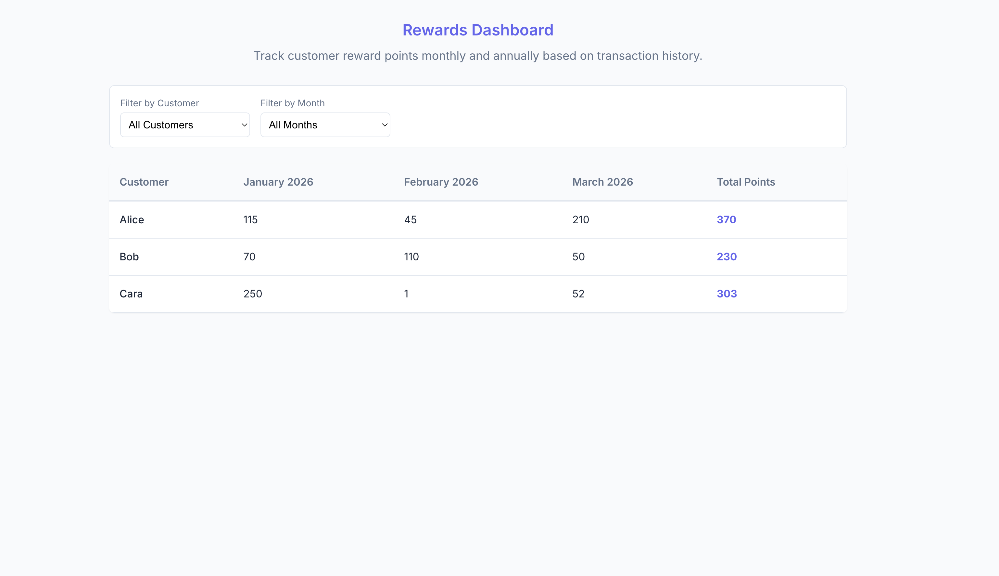

# Rewards Program Dashboard

A comprehensive React application that calculates and displays customer reward points based on transaction history.

## Screens

### Dashboard View

*Shows the main dashboard with summary statistics and the rewards table.*

### Test Coverage

*Shows the test suite execution results verifying calculation logic.*

## Features

- **Reward Calculation Engine**: Automatically calculates points based on spending tiers.
- **Monthly Aggregation**: Groups transactions by month for clear reporting.
- **Interactive Filtering**: Filter by specific customers or time periods.
- **Responsive Design**: Modern, card-based UI that works on multiple device sizes.
- **Summary Dashboard**: Quick view of total customers and points awarded.
- **Simulated API**: Asynchronous data loading with error handling.

## Calculation Logic

A customer receives points based on the per-transaction amount:
1.  **Over $100**: 2 points for every dollar spent over $100.
2.  **$50 - $100**: 1 point for every dollar spent between $50 and $100.

**Formula**:
```javascript
points = (amount > 100 ? (amount - 100) * 2 : 0) + 
         (amount > 50 ? (min(amount, 100) - 50) * 1 : 0)
```

**Example**:
A $120 transaction yields **90 points**:
- 2 × ($120 - $100) = 40 points
- 1 × ($100 - $50) = 50 points

## Project Structure

This project follows a scalable, modular architecture:

```
src/
├── api/            # Mock API services
├── assets/         # Static assets and global styles
│   └── styles/     # CSS architecture (Variables, Global, Components)
├── components/     # React Components
│   ├── common/     # Reusable UI components (Card, Loading, Error)
│   ├── filters/    # Filter controls
│   ├── layout/     # Structural components (Header)
│   └── rewards/    # Domain-specific components (Tables, Summary)
├── constants/      # Configuration and magic numbers
├── hooks/          # Custom React hooks (Data fetching, Logic)
├── utils/          # Pure utility functions (Dates, Filtering, Calculations)
├── App.js          # Main application container
└── index.js        # Entry point
```

## Design Patterns & Best Practices

- **Custom Hooks**: Business logic extracted into `useTransactions` and `useFilters`.
- **Component Composition**: Small, focused components (FiltersBar, RewardsTable) built from primitives.
- **CSS Variables**: Theming system handling colors, spacing, and typography.
- **Memoization**: `useMemo` used for expensive filtering operations.
- **Separation of Concerns**: UI components are separate from data fetching/calculation logic.

## Getting Started

1.  **Install Dependencies**
    ```bash
    npm install
    ```

2.  **Run Development Server**
    ```bash
    npm run dev
    ```

3.  **Run Tests**
    ```bash
    npm test
    ```